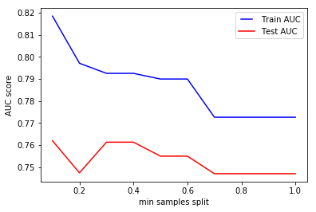
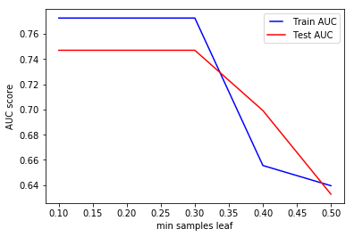

# Hyperparameter Tuning and Pruning in Decision Trees

## Introduction

Hyperparameter tuning relates to how we sample candidate model architectures from the space of all possible hyperparameter values. This is often referred to as __searching the hyperparameter space for the optimum values__. In this lesson we'll look at some of the key hyper parameters for Decision Trees and how they affect the learning and prediction processes. 

## Objectives
- Understand and explain the role of hyperparameter optimization in machine learning
- Identify the role of pruning while training a decision tree
- Understand and explain key pruning parameters that can affect the predictive performance of decision trees

## Hyperparameter Optimization

>__In machine learning, a hyperparameter is a parameter whose value is set before the learning process begins.__

By contrast, the values of model parameters are derived via training as we have seen previously.
Different model training algorithms require different hyperparameters, some simple algorithms (such as ordinary least squares regression) require none. Given these hyperparameters, the training algorithm learns the parameters from the data. For instance, LASSO is an algorithm that adds a regularization hyperparameter to ordinary least squares regression, which has to be set before estimating the parameters through the training algorithm. 

In this lesson we'll look at these sorts of optimizations in context of decision trees and see how these can effect the predictive performance as well the computational complexity of the tree. 

## Tree Pruning

Now that we know how to grow a decision tree using python and scikit-learn, let's move on and practice with the idea of __Optimization__ of the classifier. This means that we have some options available with decision trees that we can tweak before the actual learning takes place. 

A decision tree, grown beyond a certain level of complexity leads to over-fitting. If we grow our tree and carry on using poor predictors which don't have any impact on the accuracy will eventually a) slow down the learning,  and b) cause overfitting.  Different tree pruning parameters can adjust the amount of overfitting or underfitting in order to optimize for increased accuracy, precision, and/or recall.

> __This process of trimming decision trees to optimize the learning process is called "Tree Pruning".__

We can prune our trees using the following parameters:

- `Maximum Depth`

Reduce the depth of the tree to build a generalized tree. Set the depth of the tree to 3, 5, 10 depending after verification on test data

- `Minimum Samples Leaf with Split`

Restrict the size of sample leaf

- `Minimum Leaf Sample Size `

Size in terminal nodes can be fixed to 30, 100, 300 or 5% of total

- `Maximum Leaf Nodes`

Reduce the number of leaf nodes

- `Maximum Features`

Maximum number of features to consider when splitting a node

Next, we'll look at a selected few hyperparameters and learn about their impact of the classifier performance. 


## `max_depth`

The parameter for decision trees that we normally tune first is `max_depth`. This parameter indicates how deep we want our tree to be. IF the tree is too deep, it means we are creating a large number of splits in the parameter space and capturing more information about underlying data. This may result as __overfitting__ as we are learning granular information from given data , we make it difficult for our model to generalize for unseen data. This will result as a low training error but a large testing error.

If, on the other hand, the tree is too shallow, we may run into __underfitting__, i.e. we are not learning enough information about the data and the accuracy of model stays low for both test and training samples . We fit a decision tree with depths ranging from 1 to 32 and plot the training and test auc scores.


In above example, we see that as the tree depth increases, our validation/test accuracy starts to go down after a depth of around 4. But with even greater depths, the training accuracy keeps on rising , as the classifier learns more information from the data , but this can not be mapped onto unseen examples, hence the validation accuracy falls down constantly. Finding the sweet spot (e.g. depth=4) in this case would be the first hyper parameter that we need to tune. 

## `min_samples_split`
The hyper parameter `min_samples_split` is used to set the __minimum number of samples required to split an internal node__. This can vary between two extremes i.e. considering only one sample at each node vs. considering all of the samples at each node - for a given attribute. 

When we increase this parameter value, the tree becomes more constrained as it has to consider more samples at each node. Here we will vary the parameter from 10% to 100% of the samples.




In the above plot, we see that the training and testing accuracy stabilize at certain min. sample split size , and stays the same even if we carry on increasing the size of the split. This means that we will have a complex model, with similar accuracy that a much simpler model could potentially exhibit. Therefore, it is imperative that we try to identify the optimal sample size during the training phase. 

` max_depth` and `min_samples_split` are also both related to the computational cost involved with growing the tree. Large values for these parameters can create a complex, dense and long tree and with large datasets, it may become extremely time consuming to use default values.  


## `min_samples_leaf`

This hyper parameter is used to identify the minimum number of samples that we want a leaf node to contain. When this minimum size is achieved at a node, it does not get split any further.  This parameter is similar to min_samples_splits, however, this describe the minimum number of samples of samples at the leafs, the base of the tree.




Above shows the impact of this parameter on the accuracy of the classifier. We see that increasing this parameter value after an optimal point results as a drop in accuracy. That is due to under-fitting again, as keeping too many samples in our leaf nodes mean that there is still a high level of uncertainty in the data. 

The main difference between the two is that `min_samples_leaf` guarantees a minimum number of samples in a leaf, while min_samples_split can create arbitrary small leaves, though `min_samples_split` is more common in practice. These two hyper parameters make the distinction between a leaf (terminal/external node) and an internal node. An internal node will have further splits (also called children), while a leaf is by definition a node without any children (without any further splits).

For instance, if `min_samples_split = 5`, and there are 7 samples at an internal node, then the split is allowed. But let's say the split results in two leaves, one with 1 sample, and another with 6 samples. If `min_samples_leaf = 2`, then the split won't be allowed (even if the internal node has 7 samples) because one of the leaves resulted will have less then the minimum number of samples required to be at a leaf node.

### Are there more such hyperparameters ?

In addition of above, Scikit Learn offers a number of other parameters for further fine tuning the learning process. [Consult the official doc](https://scikit-learn.org/stable/modules/generated/sklearn.tree.DecisionTreeClassifier.html) to look at these parameters in detail. The parameters mentioned here are directly related to the complexity which may arise in decision trees and are normally tuned when growing trees. We'll shortly see this in action with a real dataset. 

## Additional Resources 
- [Overview of Hyperparameter Tuning ](https://cloud.google.com/ml-engine/docs/tensorflow/hyperparameter-tuning-overview)
- [Demystifying Hyperparameter Tuning](https://towardsdatascience.com/demystifying-hyper-parameter-tuning-acb83af0258f)
- [Pruning Decision Trees](https://www.displayr.com/machine-learning-pruning-decision-trees/)

## Summary 

In this lesson, we looked at the idea of hyper parameters optimization and how pruning plays an important role in restricting the growth of a decision tree , for our predictions to be accurate. We looked at a few hyper parameters which directly impact the potential over-fitting/underfitting in trees. Next we'll see these in practice using scikit-learn and python.  


```python

```
